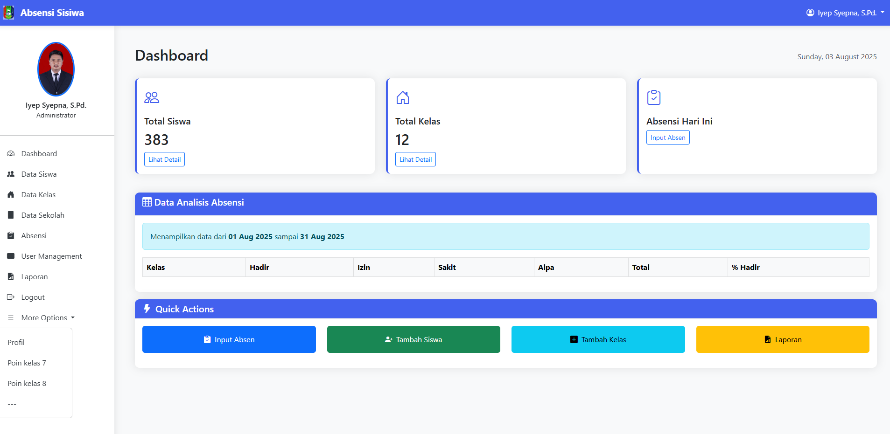
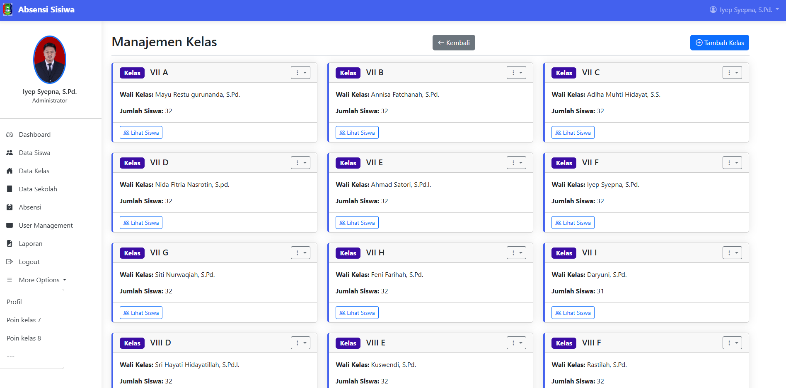

# Sistem Informasi Sekolah (PHP Native)


Sistem Informasi Sekolah berbasis web yang dibangun menggunakan PHP Native 8.2 untuk manajemen konten sekolah secara sederhana dan efisien.

## 📋 Daftar Isi
- [Fitur Utama](#✨-fitur-utama)
- [Persyaratan Sistem](#🔧-persyaratan-sistem)
- [Instalasi](#🚀-instalasi)
- [Struktur Proyek](#📂-struktur-proyek)
- [Konfigurasi](#⚙️-konfigurasi)
- [Screenshots](#📸-screenshots)
- [Kontribusi](#🤝-kontribusi)
- [Lisensi](#📜-lisensi)
- [Kontak](#📞-kontak)

## ✨ Fitur Utama

### 🗞️ Manajemen Berita
- CRUD Berita Sekolah
- Upload gambar berita
- Tampilan berita terbaru

### 🏫 Sarana Prasarana
- Kelola data ruangan
- Manajemen fasilitas sekolah
- Input jumlah ruangan

### 📜 Sejarah Sekolah
- Edit konten sejarah
- Upload gambar pendukung
- Tampilan informasi sejarah

## 🔧 Persyaratan Sistem

- **PHP** 8.2+
- **MySQL** 5.7+ atau **MariaDB** 10.3+
- **Web Server** (Apache/Nginx)
- Ekstensi PHP:
  - PDO MySQL
  - GD Library
  - Fileinfo
  - MBString

## 🚀 Instalasi

1. Clone repository:
```bash
git clone https://github.com/username/sistem-informasi-sekolah.git
cd sistem-informasi-sekolah
```

2. Buat database dan import:
```bash
mysql -u username -p nama_database < database/dump.sql
```

3. Konfigurasi:
```bash
cp config/database.example.php config/database.php
nano config/database.php
```

4. Set permissions:
```bash
chmod -R 755 image/
chmod 755 config/
```

5. Akses di browser:
```
http://localhost/sistem-informasi-sekolah/
```

## 📂 Struktur Proyek

```
webaite admin/
├── admin/
│   ├── berita/       # Manajemen berita
│   ├── sarana/       # Manajemen sarana
│   └── sejarah/      # Manajemen sejarah
├── config/
│   ├── koneksi.php   # Koneksi database
│   └── database.php  # Konfigurasi DB
├── database/
│   └── dump.sql      # Backup database
├── image/            # Penyimpanan gambar
├── assets/
│   ├── css/          # Stylesheet
│   └── js/           # JavaScript
├── index.php         # Halaman depan
└── README.md         # Dokumentasi
```

## ⚙️ Konfigurasi

Edit file `config/database.php`:

```php
<?php
return [
    'host' => 'localhost',
    'username' => 'user_db',
    'password' => 'password_db',
    'database' => 'nama_database',
    'charset' => 'utf8mb4'
];
```

## 📸 Screenshots

| Dashboard |
|--------------|----------------|
|  | 

| Kelas | Sekolah |
|-----------------|----------------|
|  |  |

## 🤝 Kontribusi

1. Fork proyek ini
2. Buat branch baru (`git checkout -b fitur-baru`)
3. Commit perubahan (`git commit -am 'Tambahkan fitur baru'`)
4. Push ke branch (`git push origin fitur-baru`)
5. Buat Pull Request

## 📜 Lisensi

Proyek ini dilisensikan di bawah **MIT License**. Lihat file [LICENSE](LICENSE) untuk detail lengkap.

## 📞 Kontak

- **Nama**: Iyep Syepna
- **Email**: info@iyepsyepna.my.id
- **Website**: https://iyepsyepna.my.id


---

<div align="center">
  <sub>Dibuat dengan ❤️ oleh <a href="https://github.com/username">C-DEV By Iyep Syepna</a></sub>
</div>
